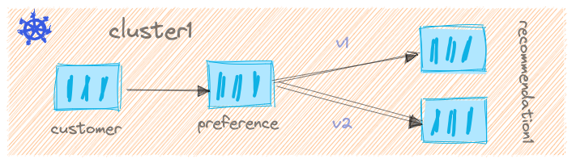

# Java Microservices

There are three different and super simple microservices in this system and they are chained together in the following  sequence:



These microservices can be used to demonstrate features of [Istio](https://isito.io)
and [Envoy Proxy](https://envoyproxy.io)

## Required Tools

- helm v3.7.1
- kubectl 1.21+
- Java 11+
- maven
- Docker for Desktop Mac/Linux/Windows

## Deploy Application

```shell
helm repo add istio-demo-apps https://kameshsampath.github.io/istio-demo-apps
helm repo update
```

### Customer

### Native

```shell
helm upgrade --install customer istio-demo-apps/customer
```

### Hotspot

```shell
helm upgrade --install customer istio-demo-apps/customer --set imageFormat="jar"
```

If you want Istio Gateway to be enabled for customer service, then you can add `--set enableIstioGateway=true` as part of your helm command.

e.g.

```shell
helm upgrade --install customer istio-demo-apps/customer --set enableIstioGateway="true"
```

### Preference

### Native

```shell
helm upgrade --install preference istio-demo-apps/preference
```

### Hotspot

```shell
helm upgrade --install preference istio-demo-apps/preference --set imageFormat="jar"
```

### Recommendation

### V1

### Native

```shell
helm upgrade --install recommendation istio-demo-apps/recommendation
```

### Hotspot

```shell
helm upgrade --install recommendation istio-demo-apps/preference --set imageFormat="jar"
```

### V2

```shell
helm upgrade --install recommendation istio-demo-apps/recommendation --set image.tag="2.0.0"
```

### Hotspot

```shell
helm upgrade --install recommendation istio-demo-apps/recommendation \
  --set image.tag="2.0.0" \
  --set imageFormat="jar"
```